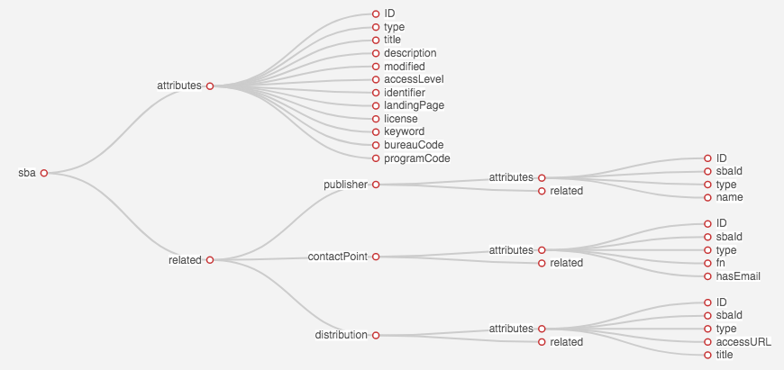

# JSON object to postgresql

Evaluation of three different parts.

- JSON object to ontology
- Ontology to PostgreSQL schema
- Postgraphile API

## Context

A JSON object (open data by different providers) will be loaded. This Object should be parsed
into an ontology. This can, later on, be used to generate a PostgreSQL schema.
On top of the created PostgreSQL schema is a query interface needed, which can be solved by Postgraphile.

# Evaluation - Step one: JSON to ontology

## Prerequesites

### Installation

`npm i`

### PostgreSQL

A PostgreSQL installation is mandatory for this project.

Visit [here](https://www.postgresql.org/docs/12/installation.html) to get infromations for the installation of PostgreSQL.

The project uses mainly all environment variables. The only exception is the database. Therefore a database needs to be created to ensure the usability of the project.

### Postgraphile API

`npm install -g postgraphile`

---

## Ontology schema

### 1. JSON schema

The following shows the desired JSON representation for the ontology :
<br/>

```JSON
{
  "name": "example_root",
  "children": [
    {
      "name": "attributes",
      "children": [
        { "name": "ID", "value": "number" },
        { "name": "uuid", "value": "string" },
        { "name": "number", "value": "string" },
            ...
      ]
    },
    {
      "name": "related",
      "children": [
        {
          "name": "example_related",
          "children": [
            {
              "name": "attributes",
              "children": [
                { "name": "ID", "value": "number" },
                { "name": "example_rootId", "value": "number" },
                    ...
              ]
            },
            { "name": "related", "children": [] }
          ]
        }
      ]
    }
  ]
}

```

### 2. Visualization

To visualize the JSON ontology a library called Echarts has been used.
<br/>



# Implementation

## main.js

## query.js

# Usage

## Custom CLI

`node main.js <json_file> <database_name>`

However the arguments can contain the following values:

- json_file:
  - sba (loads the sba json file)
  - pegel (loads the pegel json file)
- database_name
  - the name of the database created in the prerequesits should be used here

## Postgraphile API

The following comand starts the postgraphile API. As so a service starts on the port 5000 and can be accessed as a API at `http://localhost:5000/graphql`.<br/>

`--enhance-graphiql` creates a better GUI for the postgraphile API which can be reached via `http://localhost:5000/graphiql`.

---

`postgraphile -c "postgres:///<database_name>" --enhance-graphiql`

- database_name
  - the name of the database created in the prerequesits should be used here
